# Heart Disease Risk Prediction: Logistic Regression

## Project Title
Heart Disease Risk Prediction with Logistic Regression (From Scratch)

## Project Description
This project implements logistic regression from scratch (NumPy) to predict heart disease risk using the Kaggle Heart Disease dataset. It covers EDA, preprocessing, training, evaluation, decision-boundary visualization, L2 regularization, and a guided exploration of deployment on Amazon SageMaker. The notebook is fully executable and documents findings, plots, and metrics.

## Exercise Summary
Implements logistic regression for heart disease prediction: EDA, training/viz, regularization, and SageMaker deployment exploration.

## Dataset Description

In this dataset provided by **Kaggle**, we can find features that can influence wether a person has heart disease; these are:

| Column Name  | Second Header |
| ------------- | ------------- | 
| 🧓 Age  | Age of the patient in years  | 
| 🚹 Sex  | Gender of the patient (**1 = Male, 0 = Female**)  | 
| 💔 Chest pain type | **1** = Typical Angina - **2** = Atypical Angina - **3** = Non-Anginal Pain - **4** = Asymptomatic  | 
| 💉 BP | Resting blood pressure (mm Hg)  | 
| 🧈 Cholesterol | Serum cholesterol level (mg/dL)  | 
| 🍬 FBS over 120 | Fasting blood sugar > 120 mg/dL (**1 = True, 0 = False**)  | 
| 📈 EKG results  | ❤️ **0** = Normal - ⚠️ **1** = ST-T wave abnormality - 💥 **2** = Left ventricular hypertrophy | 
| ❤️ Max HR  | Maximum heart rate achieved  | 
| 🏃 Exercise angina | Exercise-induced angina (**1 = Yes, 0 = No**)  | 
| 📉 ST depression | ST depression induced by exercise relative to rest  | 
| ⛰️ Slope of ST | Slope of the peak exercise ST segment  | 
| 🩸 Number of vessels fluro | Number of major vessels (0–3) colored by fluoroscopy  | 
| 🧬 Thallium | Thallium stress test result (categorical medical indicator)  | 
| 🎯 Heart Disease | ❤️ **Presence** = Heart disease detected - 💚 **Absence** = No heart disease  | 

Taking the above into account, the v alues associated with each one will not necessarily be between 0 and 1, so it was neccesary to normalize these data using the **average** and the **standard deviation**

## Repository Structure
- Heart_Disease_Prediction.csv — dataset
- heart_disease_lr_analysis.ipynb — main notebook (EDA, model, results)
- README.md — project overview and instructions
- images/ — screenshots for SageMaker evidence and Results of Notebook

## Getting Started
Follow these steps to run the notebook locally.

### Prerequisites
- Python 3.9+
- Jupyter Notebook or JupyterLab
- Python packages: NumPy, Pandas, Matplotlib

### Installing
1. Create a virtual environment (optional but recommended).
2. Install dependencies:
	- NumPy
	- Pandas
	- Matplotlib
3. Launch Jupyter and open the notebook.

### Running the Notebook
Open heart_disease_lr_analysis.ipynb and run cells in order to:
- Load and clean data
- Train logistic regression (from scratch)
- Plot costs and decision boundaries
- Evaluate metrics on train/test splits
- Apply L2 regularization and compare results

### Exploratory Data Analysis (EDA)

To perform this procedure, we use function provided by pandas such as **info()** and **describe()**. From these, we can determine if there are missing values in the dataset or what the average, minimum, or maximum values of a given characteristic is.

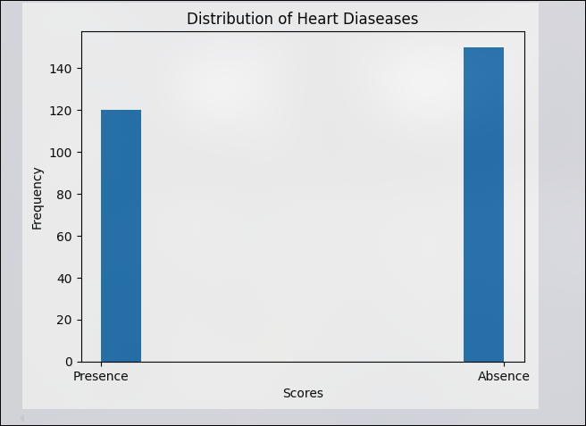

In the image above, we can see a histogram that evaluates the number of patients who have heart disease or not.

Similarly, we can use a **whisker box** with **Matplot** to identify outliers and consider normalize them.

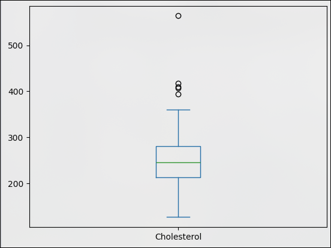

As can be seen in the image, in the data set we found some outliers with respect to cholesterol; we could normalize them, but since there are few of them, they are important for the model because they may be a single symptom depending on the patient.

We can also determine which characteristics are most influential in predicting whether a person has **heart disease**.

For Example, **ST Depression**, according to some studies, can be highly significan in indicating myocardial damage if it is the only unusual finding or symptom. **(Flores, G. (2025))**

## Results (High-Level)
- Metrics reported for train/test (accuracy, precision, recall, F1).

- **Accuracy** shows the overall proportion of correct predictions, but it can be misleading with imbalanced classes.
- **Precision** indicates how reliable positive predictions are; it matters when we want to minimize false positives.
- **Recall** measures how many real positive cases are detected; it is critical when we want to avoid missing at-risk patients.
- **F1-Score** combines precision and recall into a single value, useful when a balance between both is needed.

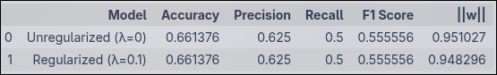

Conclusion: in the comparison with and without regularization, the regularized model tends to keep metrics more stable and achieves a better balance between precision and recall, suggesting improved generalization and a lower risk of overfitting.

- Cost vs. iterations plots for convergence.

By graphing this type of function for the **complete model**, i.e., > 6 features, we can see how it converges depending on the appropriate values we give to **alpha** and **number of iterations** respectively.

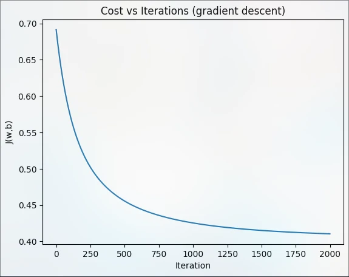

Here we can see how it tends towards convergence when it exceeds **1000** iterations with the **training dataset**.

- Decision boundary plots for multiple feature pairs.

The objective of retraining, but choosing only pairs of features, is to see how separable the class is. In some cases, we saw that good separation can be obtained through the decision limit, and in other cases, it cannot.

- **Age vs Cholesterol**: Hard to separate linearly.

- **BP vs Max HR**: Shows clearer separation but with some overlap.

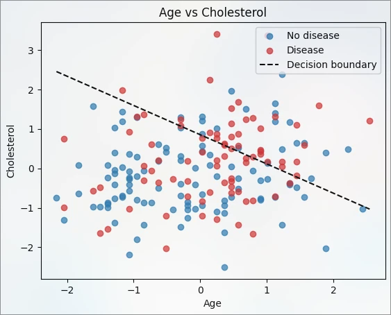

---

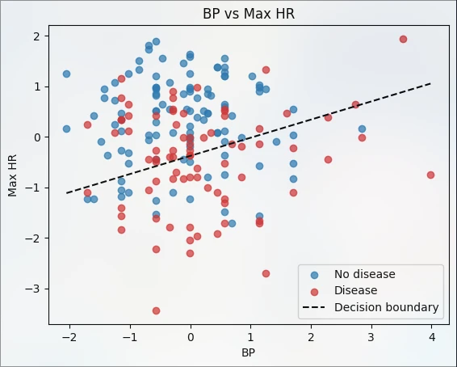

- Regularization comparison (unregularized vs. L2).

When we add the regularization term, which aims to penalyze very large weights, we can obtain the best result for the model. This can be seen by graphing **cost vs iterations** again with a respective **lambda**.

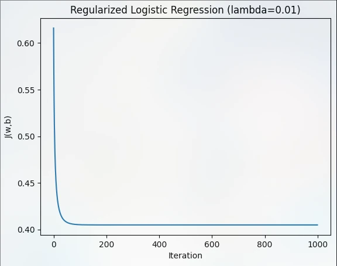

## Explore Deployment in Amazon SageMaker

Using AWS, they created an instance where they created the corresponding space to run the entire previously created model.

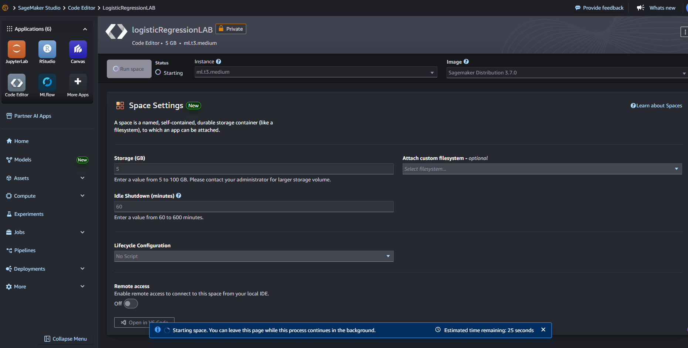

Upon launching the notebook, execute all the necessary cells to:

- Import libraries

- Load the trained model

- Verify the exported parameters

- Define the inference functions

This is done before starting the deployment process, ensuring that the environment is correctly configured and that the model works locally within the notebook.

Before deploying the model to Amazon SageMaker, it is necessary to export the best values ​​of the parameters obtained during training, both with and without the regularization term, based on the results obtained.

Additionally, the mean and standard deviation of the training set are exported, as these values ​​will be required if normalization is applied to the input data received by the production model. These parameters must be stored with the model to ensure consistency between the training and inference phases.

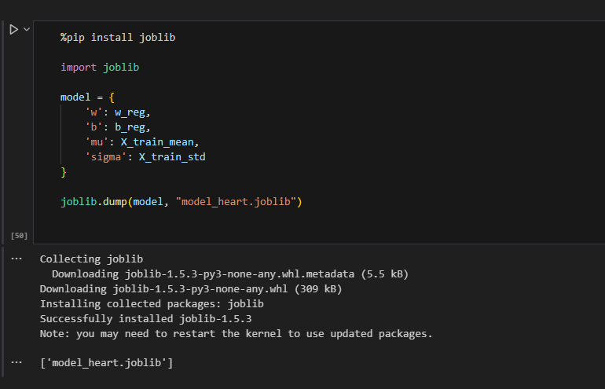

Once the parameter export is complete, access AWS Academy and then the Amazon SageMaker AI service, where a Notebook instance (Jupyter Notebook) is created.

Returning to the notebook, we created the inference functions and export the parameters in a .tar file

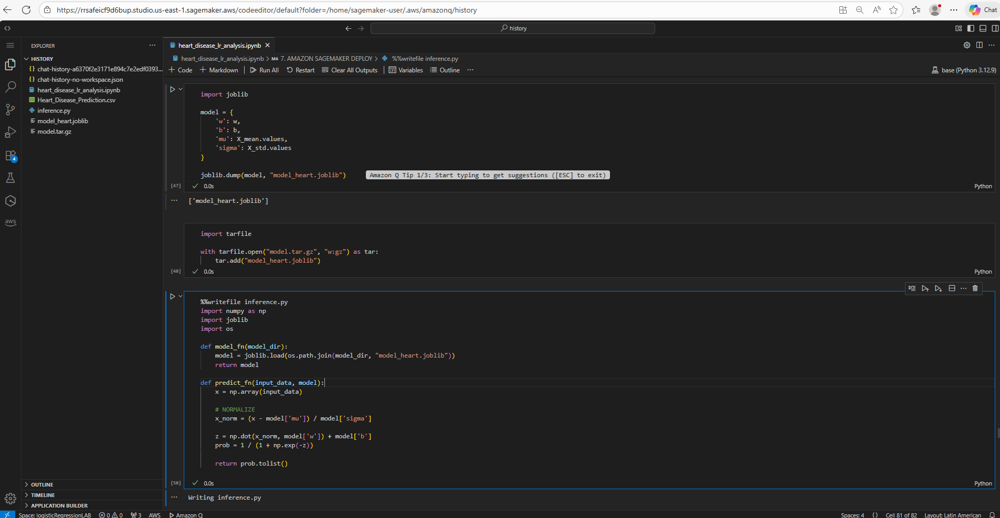

After this, using the SageMaker library on the AWS instance, we tried to store the tar file on the AWS hard drive (S3). However, we encountered problems due to a connection error.

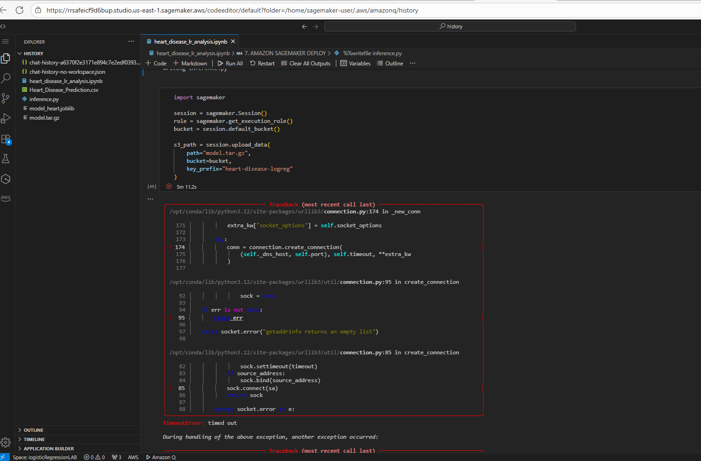

## Built With
- NumPy
- Pandas
- Matplotlib
- Jupyter Notebook

## Authors
- Tulio Riaño Sánchez

## Acknowledgments
- Kaggle and the UCI Heart Disease dataset contributors
- Notebooks explaining logistic regression
- Flores, G. (2025). **La depresión del ST en aVL como clave diagnóstica: un caso que lo cambia todo**. *ECC Trainings*. [https://ecctrainings.com/...](https://ecctrainings.com/la-depresion-del-st-en-avl-como-clave-diagnostica-un-caso-que-lo-cambia-todo/)
